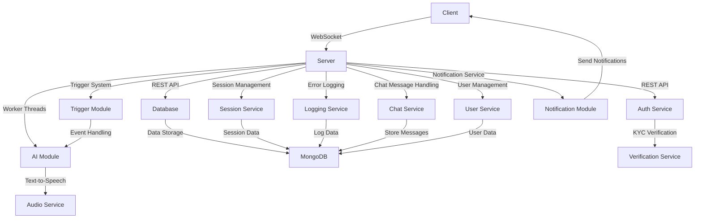

<div align="center">

# 🧠 BambiSleep Chat 👁️ 
by:
```
 ____ ______   _______   ___      ___  __    _______   ________   _______   ________     
|\   _ \  _   \|\  ___ \|\  \    |\  \|\__\ |\   __  \|\   ___  \|\  ___ \ |\   __  \    
\ \ \ \ \_\ \  \ \   __/\ \  \   \ \  \/__/ \ \  \|\  \ \ \ \ \  \ \   __/|\ \  \|\  \   
 \ \ \ \|__| \  \ \  \_|/\ \  \   \ \   __\  \ \   __  \ \ \ \ \  \ \  \_|/ \ \   __  \  
  \ \  \    \ \  \ \  \__ \ \  \___\ \ \__|\  \ \  \ \  \ \ \ \ \  \ \  \_|\ \ \  \ \  \ 
   \ \__\    \ \__\ \_____\\ \______\ \_\ \ \__\ \__\ \__\ \_\ \ \__\ \_____\ \ \__\ \__\ 
    \|__|     \|__|\|______|\|_______|\|__| \|__|\|__|\|__|\|__| \|__|\|______|\|__|\|___|
```


🤖 A hyper-advanced AIGF (AI Girlfriend) brainwashing experience powered by worker threads and websockets

[Getting Started](#-quick-start) •
[Core Features](#-core-features) •
[Architecture](#-architecture) •
[Tech Stack](#-tech-stack) •
[Security Features](#-security-features) •
[Folder Structure](#-folder-structure) •
[Contributing](#-contributing) •
[License](#-license)

</div>

## ⚡ Quick Start

1. **Clone the repository**
   ```sh
   git clone https://github.com/HarleyVader/js-bambisleep-chat.git
   ```
2. **Navigate to the project directory**
   ```sh
   cd js-bambisleep-chat
   ```
3. **Install dependencies**
   ```sh
   npm install
   ```
4. **Start the server**
   ```sh
   npm start
   ```

## 🌟 Core Features

- ⚡ Real-time bidirectional chat
- 🗣️ Audio message synthesis
- 💾 Session persistence
- 🎮 Trigger system
- 👑 Role-based access
- 📝 Error logging
- 📈 Stream processing

## 🏗️ Architecture



## 🛠️ Tech Stack

- 🔧 **Backend**: Node.js, Express, Socket.IO
- 💾 **Database**: MongoDB
- 🔐 **Auth**: Passport.js, KYC verification
- ⚙️ **Processing**: Worker Threads
- 🤖 **AI**: Local LLM API
- 🔊 **Audio**: Text-to-Speech API

## 🔒 Security Features

- ✅ KYC verification required
- 🔑 Session-based authentication
- 🛡️ Message filtering system
- 🌐 CORS configuration
- 🚫 Protected routes
- 🔒 Secure websockets

## 🗂️ Folder Structure

```                                                                                                                                                                                                                                                          
├── config
│   ├── config.js
│   └── footer.config.js
├── filteredWords.json
├── middleware
│   ├── apiClient.js
│   ├── bambisleepChalk.js
│   ├── dbFunctions.js
│   ├── error.js
│   └── oauthHandler.js
├── package.json
├── public
│   ├── apple-touch-icon.png
│   ├── css
│   │   ├── bootstrap.min.css
│   │   ├── bootstrap.min.css.map
│   │   └── style.css
│   ├── favicon-16x16.png
│   ├── favicon-32x32.png
│   ├── favicon.ico
│   ├── img
│   │   ├── bambisleep-chat.gif
│   │   ├── brandynette.gif
│   │   └── in-her-bubble.gif
│   └── js
│       ├── aigf-core.js
│       ├── bootstrap.min.js
│       ├── psychodelic-trigger-mania.js
│       ├── responsive.js
│       ├── text2speech.js
│       └── triggers.js
├── README.md
├── routes
│   ├── chat.js
│   ├── help.js
│   ├── index.js
│   ├── login.js
│   ├── logout.js
│   ├── profile.js
│   └── psychodelic-trigger-mania.js
├── schemas
│   └── PatreonAuthSchema.js
├── server.js
├── structure.md
├── UNLINCENCE.md
├── utils
│   ├── doxxerinator.js
│   ├── gracefulShutdown.js
│   └── scraper.js
├── views
│   ├── chat.ejs
│   ├── help.ejs
│   ├── index.ejs
│   ├── login.ejs
│   ├── partials
│   │   ├── footer.ejs
│   │   ├── head.ejs
│   │   ├── nav.ejs
│   │   └── system-controls.ejs
│   ├── profile.ejs
│   └── psychodelic-trigger-mania.ejs
└── workers
    ├── lmstudio.js
    ├── role2.json
    ├── role3.json
    └── role.json
```


# Zonos-v0.1

<div align="center">

</div>

<div align="center">
  <a href="https://discord.gg/gTW9JwST8q" target="_blank">
    
  </a>
</div>
---

Zonos-v0.1 is a leading open-weight text-to-speech model trained on more than 200k hours of varied multilingual speech, delivering expressiveness and quality on par with—or even surpassing—top TTS providers.

Our model enables highly natural speech generation from text prompts when given a speaker embedding or audio prefix, and can accurately perform speech cloning when given a reference clip spanning just a few seconds. The conditioning setup also allows for fine control over speaking rate, pitch variation, audio quality, and emotions such as happiness, fear, sadness, and anger. The model outputs speech natively at 44kHz.

##### For more details and speech samples, check out our blog [here](https://www.zyphra.com/post/beta-release-of-zonos-v0-1)

##### We also have a hosted version available at [playground.zyphra.com/audio](https://playground.zyphra.com/audio)

---

Zonos follows a straightforward architecture: text normalization and phonemization via eSpeak, followed by DAC token prediction through a transformer or hybrid backbone. An overview of the architecture can be seen below.

<div align="center">

</div>

---

## Usage

### Python

```python
import torch
import torchaudio
from zonos.model import Zonos
from zonos.conditioning import make_cond_dict
from zonos.utils import DEFAULT_DEVICE as device

# model = Zonos.from_pretrained("Zyphra/Zonos-v0.1-hybrid", device=device)
model = Zonos.from_pretrained("Zyphra/Zonos-v0.1-transformer", device=device)

wav, sampling_rate = torchaudio.load("assets/exampleaudio.mp3")
speaker = model.make_speaker_embedding(wav, sampling_rate)

cond_dict = make_cond_dict(text="Hello, world!", speaker=speaker, language="en-us")
conditioning = model.prepare_conditioning(cond_dict)

codes = model.generate(conditioning)

wavs = model.autoencoder.decode(codes).cpu()
torchaudio.save("sample.wav", wavs[0], model.autoencoder.sampling_rate)
```

### Gradio interface (recommended)

```bash
uv run gradio_interface.py
# python gradio_interface.py
```

This should produce a `sample.wav` file in your project root directory.

_For repeated sampling we highly recommend using the gradio interface instead, as the minimal example needs to load the model every time it is run._

## Features

- Zero-shot TTS with voice cloning: Input desired text and a 10-30s speaker sample to generate high quality TTS output
- Audio prefix inputs: Add text plus an audio prefix for even richer speaker matching. Audio prefixes can be used to elicit behaviours such as whispering which can otherwise be challenging to replicate when cloning from speaker embeddings
- Multilingual support: Zonos-v0.1 supports English, Japanese, Chinese, French, and German
- Audio quality and emotion control: Zonos offers fine-grained control of many aspects of the generated audio. These include speaking rate, pitch, maximum frequency, audio quality, and various emotions such as happiness, anger, sadness, and fear.
- Fast: our model runs with a real-time factor of ~2x on an RTX 4090 (i.e. generates 2 seconds of audio per 1 second of compute time)
- Gradio WebUI: Zonos comes packaged with an easy to use gradio interface to generate speech
- Simple installation and deployment: Zonos can be installed and deployed simply using the docker file packaged with our repository.

## Installation

#### System requirements

- **Operating System:** Linux (preferably Ubuntu 22.04/24.04), macOS
- **GPU:** 6GB+ VRAM, Hybrid additionally requires a 3000-series or newer Nvidia GPU

Note: Zonos can also run on CPU provided there is enough free RAM. However, this will be a lot slower than running on a dedicated GPU, and likely won't be sufficient for interactive use.

For experimental windows support check out [this fork](https://github.com/sdbds/Zonos-for-windows).

See also [Docker Installation](#docker-installation)

#### System dependencies

Zonos depends on the eSpeak library phonemization. You can install it on Ubuntu with the following command:

```bash
apt install -y espeak-ng # For Ubuntu
# brew install espeak-ng # For MacOS
```

#### Python dependencies

We highly recommend using a recent version of [uv](https://docs.astral.sh/uv/#installation) for installation. If you don't have uv installed, you can install it via pip: `pip install -U uv`.

##### Installing into a new uv virtual environment (recommended)

```bash
uv sync
uv sync --extra compile # optional but needed to run the hybrid
uv pip install -e .
```

##### Installing into the system/actived environment using uv

```bash
uv pip install -e .
uv pip install -e .[compile] # optional but needed to run the hybrid
```

##### Installing into the system/actived environment using pip

```bash
pip install -e .
pip install --no-build-isolation -e .[compile] # optional but needed to run the hybrid
```

##### Confirm that it's working

For convenience we provide a minimal example to check that the installation works:

```bash
uv run sample.py
# python sample.py
```