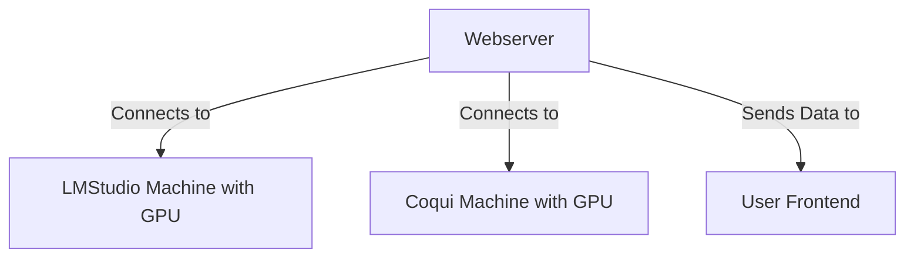

# 🧠 [BambiSleep.Chat](https://bambisleep.chat) 👁️
💖 A [r/bambisleep](https://www.reddit.com/r/BambiSleep/) targeted Hypnotic AIGF (AI Girlfriend) 🤖

<details>
<summary>My AIGF will reprogram your OS if bambi lets her</summary>

> - Brainwashing 
> - Mindfuckery 
> - Psychodelic Spiral 
> - Trigger Mania
> - Neurolinguistic Programing
> - Cognitive Behavioural Therapy

</details>

<!-- prettier-ignore-start -->
<!-- markdownlint-disable -->
<!-- eslint-disable -->
<!-- copilot:ignore -->
```markdown
 _____ ______   _______   ___       ___  __    ________  ________   _______   ________
|\   _ \  _   \|\  ___ \ |\  \     |\  \|\  \ |\   __  \|\   ___  \|\  ___ \ |\   __  \
\ \ \ \ \_\ \  \ \   __/|\ \  \    \ \  \/  /|\ \  \|\  \ \ \ \ \  \ \   __/|\ \  \|\  \
 \ \ \ \|__| \  \ \  \_|/_\ \  \    \ \   ___  \ \   __  \ \ \ \ \  \ \  \_|/_\ \   __  \
  \ \  \    \ \  \ \  \_|\ \ \  \____\ \ \ \ \  \ \  \ \  \ \ \ \ \  \ \  \_|\ \ \  \ \  \
   \ \__\    \ \__\ \_______\ \_______\ \_\ \ \__\ \__\ \__\ \_\ \ \__\ \_______\ \__\ \__\
    \|__|     \|__|\|_______|\|_______|\|__| \|__|\|__|\|__| \|__|\|_______|\|__|\|__| |__|
```
<!-- copilot:end-ignore -->
<!-- eslint-enable -->
<!-- markdownlint-enable -->
<!-- prettier-ignore-end -->

<details>
<summary>Lawfull Good Scrapers</summary>

> The Lawful Good Bambisleep Scrapers are designed to facilitate the scraping, processing, and analysis of content related to BambiSleep. It utilizes multiple worker 
> threads to handle different content types, including text, images, and videos. The project is structured to allow for easy extension and integration of various models 
> for enhanced performance and capabilities.

</details>

```js
Running Version: MK-X
Monetization: Patreon
```

## Overview


[Getting Started](#-quick-start) •
[Core Features](#-core-features) •
[Architecture](#-architecture) •
[Tech Stack](#-tech-stack) •
[Security Features](#-security-features) •
[Folder Structure](#-folder-structure) •
[Contributing](#-contributing) •
[License](#-license)

## 🌟 Core Features

- ⚡ Global Chat
- 🗣️ Audio message synthesis
- 💾 Bambi name Persistence
- 🎮 Trigger system
- 👑 Free for All Access
- 📝 Custom Collar
- 📈 Stream processing
- 👤 Customizable user profiles

## Project Components

### Main Application

The main BambiSleep Chat application provides a real-time platform for users to interact with an AI girlfriend tailored for the BambiSleep community.

### BambiSleep Profile

BambiSleep Profile is a web application that allows users to create and manage customizable profiles. Each profile includes an avatar, header, about section, and description. The application utilizes real-time updates through Socket.IO and stores profile data in a MongoDB database.

#### Profile Features

- Customizable user profiles with avatar, header, about, and description
- Real-time updates using Socket.IO for seamless user experience
- CRUD operations for managing profiles
- Responsive design with CSS styling

### Realtime Express App

This component is a real-time web application built using Express, EJS, Socket.io, and Mongoose. It provides a platform for users to interact in real-time through a chat interface, while also managing user data with a MongoDB database.

#### Realtime Features

- Real-time messaging using Socket.io
- User authentication and management
- Dynamic views rendered with EJS
- RESTful API for user data
- Error handling middleware
- Structured project with MVC architecture

## 🏗️ Architecture



### AIGF SKILLS:
1. ### **text-to-text**  
- Write your prompt & submit  
- bambisleep will reply as bambisleep & call you bambi  
- bambisleep will use the selected triggers to do a brainwashing session based on your  
2. ### **Psychedelic Trigger Mania** 
- Causes temporary Hallucination's lasting longer the longer you stare into it.   
3. ### **Triggers:**
- Enable the spiral to show the triggers replied by my AI GF  
4. ### **Text2Audio**  
- she will say out loud what she said with text.  
- Now audio/text/spiral are in sync.   
- Everything is synchronized  
5. ### **Chat**
- write in the global chat  
- If you are logged i the chat will show your Patreon username  
- Home Chat & Profile chat are the same chat, only difference is being logged into Patreon  
6. ### **Profiles**
- Create and manage your profile
- Customize avatar, header, and description
- Interact with other users' profiles

## Getting Started

### Environment Variables

**Configure Environment Variables**
Create a .env file in the root directory and add the necessary environment variables, such as database connection but most importantly the remote addesses & ports of your servers. 

- LMS_HOST: Hostname for the LMStudio server.
- LMS_PORT: Port for the LMStudio server.
- MONGODB_URI: MongoDB connection string.
- MODEL_1: Model 1 identifier.
- MODEL_2: Model 2 identifier.
- CACHE_ENABLED: Enable or disable caching (true/false).
- CACHE_EXPIRY: Cache expiry time in seconds.
- API_KEY: API key for authentication.
- SECRET_KEY: Secret key for encryption.

<details>

> ```bash
> nano .env
> SERVER_PORT=6969
> LMS_HOST=192.168.0.178
> LMS_PORT=7777
> SPEECH_HOST=192.168.0.178
> SPEECH_PORT=5002
> MONGODB_URI=mongodb://127.0.0.1:27017/?directConnection=true&serverSelectionTimeoutMS=2000&appName=mongosh+2.4.2
> MODEL_1=llama-3.2-3b-claude-3.7-sonnet-reasoning-distilled@q4_0
> MODEL_2=L3-SthenoMaidBlackroot-8B-V1@q2_k
> ```

<summary>mindless AIGF you just post the .env!<summary>
</details>

### Installation

#### Creating a new python venv environment & activating it

```bash
python3 -m venv .f5-tts
source .f5-tts/bin/activate
```

#### Install PyTorch with matched device

<details>
<summary>NVIDIA GPU</summary>

> ```bash
> # Install pytorch with your CUDA version, e.g.
> pip install torch==2.4.0+cu124 torchaudio==2.4.0+cu124 --extra-index-url https://download.pytorch.org/whl/cu124
> ```

</details>

<details>
<summary>AMD GPU</summary>

> ```bash
> # Install pytorch with your ROCm version (Linux only), e.g.
> pip install torch==2.5.1+rocm6.2 torchaudio==2.5.1+rocm6.2 --extra-index-url https://download.pytorch.org/whl/rocm6.2
> ```

</details>

<details>
<summary>Intel GPU</summary>

> ```bash
> # Install pytorch with your XPU version, e.g.
> # Intel® Deep Learning Essentials or Intel® oneAPI Base Toolkit must be installed
> pip install torch torchaudio --index-url https://download.pytorch.org/whl/test/xpu
> 
> # Intel GPU support is also available through IPEX (Intel® Extension for PyTorch)
> # IPEX does not require the Intel® Deep Learning Essentials or Intel® oneAPI Base Toolkit
> # See: https://pytorch-extension.intel.com/installation?request=platform
> ```

</details>

<details>
<summary>Apple Silicon</summary>

> ```bash
> # Install the stable pytorch, e.g.
> pip install torch torchaudio
> ```

</details>

#### Installing into the system/actived environment using pip

```bash
pip install -e .
```

#### Node Version Manager
```bash
# windows
curl -o- https://raw.githubusercontent.com/nvm-sh/nvm/v0.40.2/install.sh | bash
# linux
wget -qO- https://raw.githubusercontent.com/nvm-sh/nvm/v0.40.2/install.sh | bash
# instantly makes nvm available whitout having to restart the terminal
export NVM_DIR="$([ -z "${XDG_CONFIG_HOME-}" ] && printf %s "${HOME}/.nvm" || printf %s "${XDG_CONFIG_HOME}/nvm")"
[ -s "$NVM_DIR/nvm.sh" ] && \. "$NVM_DIR/nvm.sh" # This loads nvm
```

#### Install Latest Node with NVM
```bash
nvm install node
```

#### Install NodeJS Modules
```bash
npm install
```

#### Confirm that it's working
```bash
npm run start
```

### Docker Usage
```bash
# Build from Dockerfile
docker build -t f5tts:v1 .

# Run from GitHub Container Registry
docker container run --rm -it --gpus=all --mount 'type=volume,source=f5-tts,target=/root/.cache/huggingface/hub/' -p 7860:7860 ghcr.io/swivid/f5-tts:main

# Quickstart if you want to just run the web interface (not CLI)
docker container run --rm -it --gpus=all --mount 'type=volume,source=f5-tts,target=/root/.cache/huggingface/hub/' -p 7860:7860 ghcr.io/swivid/f5-tts:main f5-tts_infer-gradio --host 0.0.0.0
```

## Project Structure

```mermaid
graph LR
    %% Main Server Node in center
    Server[server.js] --> Routes
    Server --> Views
    Server --> Middleware
    Server --> Utils
    Server --> PublicAssets
    Server --> ExternalServices
    Server --> PatreonAuth[PatreonAuthSchema.js]
    Server --> Config
    Server --> Models
    Server --> Services
    Server --> Workers
    Server --> Database[MongoDB]

    %% Top Row - Routes and Views
    subgraph FrontendLayer["Frontend Layer"]
        Routes --> RouteChat[routes/chat.js]
        Routes --> RouteHelp[routes/help.js] 
        Routes --> RouteIndex[routes/index.js]
        Routes --> RouteLogin[routes/login.js]
        Routes --> RouteLogout[routes/logout.js]
        Routes --> RouteProfile[routes/profile.js]
        Routes --> RoutePTM[routes/psychodelic-trigger-mania.js]
        Routes --> RouteScrapers[routes/scrapers.js]

        Views --> ViewChat[chat.ejs]
        Views --> ViewHelp[help.ejs] 
        Views --> ViewIndex[index.ejs]
        Views --> ViewPTM[psychodelic-trigger-mania.ejs]
        Views --> ViewScrapers[scrapers.ejs]
        Views --> ViewPartials[partials/]
    end

    %% Middle Row - Assets, Config and Processing
    subgraph AssetLayer["Asset and Processing Layer"]
        PublicAssets --> CSS[css/style.css]
        PublicAssets --> JavaScript
        PublicAssets --> Images[img/]

        Middleware --> BambisleepChalk[bambisleepChalk.js]
        Middleware --> ErrorHandler[error.js]
        
        Utils --> Doxxerinator[doxxerinator.js]
        Utils --> GracefulShutdown[gracefulShutdown.js]
        Utils --> DBConnection[dbConnection.js]
        Utils --> Logger[logger.js]
        Utils --> JsonSchemaGenerator[jsonSchemaGenerator.js]
        Utils --> PromptTemplates[promptTemplates.js]

        Config --> AppConfig[config.js]
        Config --> FooterConfig[footer.config.js]
        Config --> ModelConfig[modelConfig.js]

        Models --> ModelCache[modelCache.js]
        Models --> ModelManager[modelManager.js]

        Services --> InferenceService[inferenceService.js]
        Services --> ProcessingService[processingService.js]
    end

    %% Bottom Row - Client-side JS, Workers and External Services
    subgraph ClientLayer["Client Side and Services Layer"]
        JavaScript --> AIGFCore[aigf-core.js]
        JavaScript --> Responsive[responsive.js]
        JavaScript --> PTMScript[psychodelic-trigger-mania.js]
        JavaScript --> Text2Speech[text2speech.js]
        JavaScript --> Triggers[triggers.js]
        JavaScript --> ScrapersScript[scrapers.js]

        Workers --> LMStudioWorker[lmstudio.js]
        Workers --> SpeecherWorker[speecher.js]
        Workers --> WorkerCoordinator[workerCoordinator.js]
        Workers --> ScraperWorkers[scrapers/*]
        
        ExternalServices --> LMStudio[LMStudio Machine]
        ExternalServices --> Coqui[Coqui Machine]
        ExternalServices --> F5TTS[F5-TTS]
        
        Database --> PatreonData[Patreon Auth]
        Database --> ScraperData[Scraper Data]
    end

    %% Define styles using CSS variables from style.css
    classDef serverNode fill:#0c2a2a,stroke:#15aab5,stroke-width:4px
    classDef frontendLayerStyle fill:#df0471,stroke:#01c69e,stroke-width:4px
    classDef assetLayerStyle fill:#cc0174,stroke:#01c69e,stroke-width:4px
    classDef clientLayerStyle fill:#40002f,stroke:#01c69e,stroke-width:4px
    
    class Server serverNode
    class FrontendLayer frontendLayerStyle
    class AssetLayer assetLayerStyle
    class ClientLayer clientLayerStyle
```


## 🛠️ Tech Stack

- 🔧 **Backend**: Node.js, Express, Socket.IO
- ⚙️ **Processing**: Worker Threads, Child Process
- 🤖 **AI**: Llama3 Lexi Uncensored
- 🔊 **Audio**: F5-TTS, Coqui-tts
- 🖥️ **Frontend**: EJS, Express, Socket.io
- 🛠️ **Utilities**: Axios
- 📊 **Database**: MongoDB, Mongoose

## 🔒 Security Features

- ✅ KYC verification required
- 🔑 Session-based authentication
- 🛡️ Message filtering system
- 🌐 CORS configuration
- 🚫 Protected routes
- 🔒 Secure websockets

## 🗂️ Folder Structure

<details>
<summary>Expand to see detailed folder structure</summary>

See README.md for full folder structure listing.
</details>

## 📋 Usage

- Visit `http://localhost:6969` to access the main application.
- Create a new profile or edit an existing one at `/profiles`.
- Use the chat interface to interact with the AI.
- Explore various features like Text2Speech, Triggers, and Psychedelic Trigger Mania.

## 🤝 Contributing

Contributions are welcome! Please open an issue or submit a pull request for any enhancements or bug fixes.

## 📄 License

This project is licensed under the MIT License. See the LICENSE file for details.