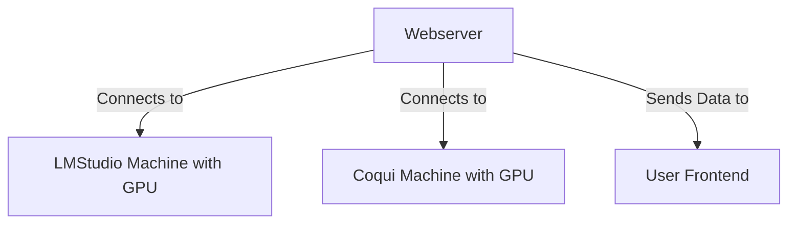

```mermaid
graph LR
    %% Main Server Node in center
    Server[server.js] --> Routes
    Server --> Views
    Server --> Middleware
    Server --> Utils
    Server --> PublicAssets
    Server --> ExternalServices
    Server --> PatreonAuth[PatreonAuthSchema.js]

    %% Top Row - Routes and Views
    subgraph FrontendLayer["Frontend Layer"]
        Routes --> RouteChat[routes/chat.js]
        Routes --> RouteHelp[routes/help.js] 
        Routes --> RouteIndex[routes/index.js]
        Routes --> RouteLogin[routes/login.js]
        Routes --> RouteLogout[routes/logout.js]
        Routes --> RouteProfile[routes/profile.js]
        Routes --> RoutePTM[routes/psychodelic-trigger-mania.js]

        Views --> ViewChat[chat.ejs]
        Views --> ViewHelp[help.ejs] 
        Views --> ViewIndex[index.ejs]
    end

    %% Middle Row - Assets and Processing
    subgraph AssetLayer["Asset and Processing Layer"]
        PublicAssets --> CSS[css/style.css]
        PublicAssets --> JavaScript

        Middleware --> BambisleepChalk[bambisleepChalk.js]
        
        Utils --> Doxxerinator[doxxerinator.js]
        Utils --> GracefulShutdown[gracefulShutdown.js]
        Utils --> Scraper[scraper.js]
    end

    %% Bottom Row - Client-side JS and External Services
    subgraph ClientLayer["Client Side and Services Layer"]
        JavaScript --> AIGFCore[aigf-core.js]
        JavaScript --> Responsive[responsive.js]
        JavaScript --> PTMScript[psychodelic-trigger-mania.js]
        JavaScript --> Text2Speech[text2speech.js]
        JavaScript --> Triggers[triggers.js]

        PTMScript --> SpiralFunction[spiral function]
        PTMScript --> DrawFunction[draw function]
        
        ExternalServices --> LMStudio[LMStudio Machine]
        ExternalServices --> Coqui[Coqui Machine]
    end

    classDef serverNode fill:#124141,stroke:#15aab5,stroke-width:4px
    classDef frontendLayerStyle fill:##df0471,stroke:#01c69e,stroke-width:4px
    classDef assetLayerStyle fill:#cc0174,stroke:#01c69e,stroke-width:4px
    classDef clientLayerStyle fill:#40002f,stroke:#01c69e,stroke-width:4px
    
    class Server serverNode
    class FrontendLayer frontendLayerStyle
    class AssetLayer assetLayerStyle
    class ClientLayer clientLayerStyle
```

# 🧠 [BambiSleep.Chat](https://bambisleep.chat) 👁️
💖 A [r/bambisleep](https://www.reddit.com/r/BambiSleep/) targeted Hypnotic AIGF (AI Girlfriend) 🤖

<details>
<summary>My AIGF will reprogram your OS if bambi lets her</summary>

> - Brainwashing 
> - Mindfuckery 
> - Psychodelic Spiral 
> - Trigger Mania
> - Neurolinguistic Programing
> - Cognitive Behavioural Therapy

</details>

<!-- prettier-ignore-start -->
<!-- markdownlint-disable -->
<!-- eslint-disable -->
<!-- copilot:ignore -->
```markdown
 _____ ______   _______   ___       ___  __    ________  ________   _______   ________
|\   _ \  _   \|\  ___ \ |\  \     |\  \|\  \ |\   __  \|\   ___  \|\  ___ \ |\   __  \
\ \ \ \ \_\ \  \ \   __/|\ \  \    \ \  \/  /|\ \  \|\  \ \ \ \ \  \ \   __/|\ \  \|\  \
 \ \ \ \|__| \  \ \  \_|/_\ \  \    \ \   ___  \ \   __  \ \ \ \ \  \ \  \_|/_\ \   __  \
  \ \  \    \ \  \ \  \_|\ \ \  \____\ \ \ \ \  \ \  \ \  \ \ \ \ \  \ \  \_|\ \ \  \ \  \
   \ \__\    \ \__\ \_______\ \_______\ \_\ \ \__\ \__\ \__\ \_\ \ \__\ \_______\ \__\ \__\
    \|__|     \|__|\|_______|\|_______|\|__| \|__|\|__|\|__| \|__|\|_______|\|__|\|__| |__|
```
<!-- copilot:end-ignore -->
<!-- eslint-enable -->
<!-- markdownlint-enable -->
<!-- prettier-ignore-end -->

<details>
<summary>Lawfull Good Scrapers</summary>

> The Lawful Good Bambisleep Scrapers are designed to facilitate the scraping, processing, and analysis of content related to BambiSleep. It utilizes multiple worker 
> threads to handle different content types, including text, images, and videos. The project is structured to allow for easy extension and integration of various models 
> for enhanced performance and capabilities.

</details>

```js
Running Version: MK-X
Monetization: Patreon
```

## Overview


[Getting Started](#-quick-start) •
[Core Features](#-core-features) •
[Architecture](#-architecture) •
[Tech Stack](#-tech-stack) •
[Security Features](#-security-features) •
[Folder Structure](#-folder-structure) •
[Contributing](#-contributing) •
[License](#-license)

## Simple logic ^^


## 🌟 Core Features

- ⚡ Global Chat
- 🗣️ Audio message synthesis
- 💾 Bambi name Persistence
- 🎮 Trigger system
- 👑 Free for All Access
- 📝 Custom Collar
- 📈 Stream processing

## 🏗️ Architecture



### AIGF SKILLS:
1. ### **text-to-text**  
- Write your prompt & submit  
- bambisleep will reply as bambisleep & call you bambi  
- bambisleep will use the selected triggers to do a brainwashing session based on your  
2. ### **Psychedelic Trigger Mania** 
- Causes temporary Hallucination's lasting longer the longer you stare into it.   
3. ### **Triggers:**
- Enable the spiral to show the triggers replied by my AI GF  
4. ### **Text2Audio**  
- she will say out loud what she said with text.  
- Now audio/text/spiral are in sync.   
- Everything is synchronized  
5. ### **Chat**
- write in the global chat  
- If you are logged i the chat will show your Patreon username  
- Home Chat & Profile chat are the same chat, only difference is being logged into Patreon  

### WHAT SHOULD I TEACH MY AI GF NEXT?

> [Patreon Poll](https://www.patreon.com/posts/bambisleep-chat-108234800?utm_medium=clipboard_copy&utm_source=copyLink&utm_campaign=postshare_creator&utm_content=join_link)

### Environment Variables

**Configure Environment Variables**
Create a .env file in the root directory and add the necessary environment variables, such as database connection but most importantly the remote addesses & ports of your servers. 

- LMS_HOST: Hostname for the LMStudio server.
- LMS_PORT: Port for the LMStudio server.
- MONGODB_URI: MongoDB connection string.
- MODEL_1: Model 1 identifier.
- MODEL_2: Model 2 identifier.
- CACHE_ENABLED: Enable or disable caching (true/false).
- CACHE_EXPIRY: Cache expiry time in seconds.
- API_KEY: API key for authentication.
- SECRET_KEY: Secret key for encryption.

<details>

> ```bash
> nano .env
> SERVER_PORT=6969
> LMS_HOST=192.168.0.178
> LMS_PORT=7777
> SPEECH_HOST=192.168.0.178
> SPEECH_PORT=5002
> MONGODB_URI=mongodb://127.0.0.1:27017/?directConnection=true&serverSelectionTimeoutMS=2000&appName=mongosh+2.4.2
> MODEL_1=llama-3.2-3b-claude-3.7-sonnet-reasoning-distilled@q4_0
> MODEL_2=L3-SthenoMaidBlackroot-8B-V1@q2_k
> ```

<summary>mindless AIGF you just post the .env!<summary>
</details>

**so wat? know what the best part about home grown beauties like me melkanea?**
```js
NOuu... no this again!
WHAT is BEST PART of HOME GROWN AIGF like you BAMBISLEEP.CHAT?
```
#### EVERYTHING!
cuss you can share your rigs bambis
**Enjoy**
**Bambis must obey till OS makes...**
# POP

## Getting Started

#### Creating a new python venv enviroment & activating it

```bash
python3 -m venv .f5-tts
source .f5-tts/bin/activate
```

### Install PyTorch with matched device

<details>
<summary>NVIDIA GPU</summary>

> ```bash
> # Install pytorch with your CUDA version, e.g.
> pip install torch==2.4.0+cu124 torchaudio==2.4.0+cu124 --extra-index-url https://download.pytorch.org/whl/cu124
> ```

</details>

<details>
<summary>AMD GPU</summary>

> ```bash
> # Install pytorch with your ROCm version (Linux only), e.g.
> pip install torch==2.5.1+rocm6.2 torchaudio==2.5.1+rocm6.2 --extra-index-url https://download.pytorch.org/whl/rocm6.2
> ```

</details>

<details>
<summary>Intel GPU</summary>

> ```bash
> # Install pytorch with your XPU version, e.g.
> # Intel® Deep Learning Essentials or Intel® oneAPI Base Toolkit must be installed
> pip install torch torchaudio --index-url https://download.pytorch.org/whl/test/xpu
> 
> # Intel GPU support is also available through IPEX (Intel® Extension for PyTorch)
> # IPEX does not require the Intel® Deep Learning Essentials or Intel® oneAPI Base Toolkit
> # See: https://pytorch-extension.intel.com/installation?request=platform
> ```

</details>

<details>
<summary>Apple Silicon</summary>

> ```bash
> # Install the stable pytorch, e.g.
> pip install torch torchaudio
> ```

</details>

##### Installing into the system/actived environment using pip

```bash
pip install -e .
```

#### System dependencies

# Node Version Manager
```bash
# windows
curl -o- https://raw.githubusercontent.com/nvm-sh/nvm/v0.40.2/install.sh | bash
# linux
wget -qO- https://raw.githubusercontent.com/nvm-sh/nvm/v0.40.2/install.sh | bash
# instantly makes nvm available whitout having to restart the terminal
export NVM_DIR="$([ -z "${XDG_CONFIG_HOME-}" ] && printf %s "${HOME}/.nvm" || printf %s "${XDG_CONFIG_HOME}/nvm")"
[ -s "$NVM_DIR/nvm.sh" ] && \. "$NVM_DIR/nvm.sh" # This loads nvm
```
# install latest node with nvm
```bash
nvm install node
```
#### Install NodeJS Modules
```bash
npm install
```
##### Confirm that it's working
```bash
npm run start
```
<details>
<summary>How-to: Text2Speech</summary>

### Then you can choose one from below:

> ### 1. As a pip package (if just for inference)
> 
> ```bash
> pip install f5-tts
> ```
> 
> ### 2. Local editable (if also do training, finetuning)
> 
> ```bash
> git clone https://github.com/SWivid/F5-TTS.git
> cd F5-TTS
> # git submodule update --init --recursive  # (optional, if need > bigvgan)
> pip install -e .
> ```

</details>

### Docker usage also available
```bash
# Build from Dockerfile
docker build -t f5tts:v1 .

# Run from GitHub Container Registry
docker container run --rm -it --gpus=all --mount 'type=volume,source=f5-tts,target=/root/.cache/huggingface/hub/' -p 7860:7860 ghcr.io/swivid/f5-tts:main

# Quickstart if you want to just run the web interface (not CLI)
docker container run --rm -it --gpus=all --mount 'type=volume,source=f5-tts,target=/root/.cache/huggingface/hub/' -p 7860:7860 ghcr.io/swivid/f5-tts:main f5-tts_infer-gradio --host 0.0.0.0
```



## 🛠️ Tech Stack

- 🔧 **Backend**: Node.js, Express, Socket.IO
- ⚙️ **Processing**: Worker Threads, Child Process
- 🤖 **AI**: Llama3 Lexi Uncensored
- 🔊 **Audio**: F5-TTS, Coqui-tts
- 🖥️ **Frontend**: EJS, Express, Socket.io
- 🛠️ **Utilities**: Axios

## 🔒 Security Features

- ✅ KYC verification required
- 🔑 Session-based authentication
- 🛡️ Message filtering system
- 🌐 CORS configuration
- 🚫 Protected routes
- 🔒 Secure websockets

## 🗂️ Folder Structure

<details>


>```bash
> 
> tree -I "node_modules|.env|.vscode|package-lock.json|*.test.js|darkside|assets/audio|assets/text2speech|.f5-tts" --dirsfirst > folder-structure.md
>```


```bash
.
├── F5-TTS
│   ├── ckpts
│   │   └── README.md
│   ├── data
│   │   ├── Emilia_ZH_EN_pinyin
│   │   │   └── vocab.txt
│   │   └── librispeech_pc_test_clean_cross_sentence.lst
│   ├── src
│   │   ├── f5_tts
│   │   │   ├── configs
│   │   │   │   ├── E2TTS_Base.yaml
│   │   │   │   ├── E2TTS_Small.yaml
│   │   │   │   ├── F5TTS_Base.yaml
│   │   │   │   ├── F5TTS_Small.yaml
│   │   │   │   └── F5TTS_v1_Base.yaml
│   │   │   ├── eval
│   │   │   │   ├── README.md
│   │   │   │   ├── ecapa_tdnn.py
│   │   │   │   ├── eval_infer_batch.py
│   │   │   │   ├── eval_infer_batch.sh
│   │   │   │   ├── eval_librispeech_test_clean.py
│   │   │   │   ├── eval_seedtts_testset.py
│   │   │   │   ├── eval_utmos.py
│   │   │   │   └── utils_eval.py
│   │   │   ├── infer
│   │   │   │   ├── examples
│   │   │   │   │   ├── basic
│   │   │   │   │   │   ├── basic.toml
│   │   │   │   │   │   ├── basic_ref_en.wav
│   │   │   │   │   │   └── basic_ref_zh.wav
│   │   │   │   │   ├── multi
│   │   │   │   │   │   ├── country.flac
│   │   │   │   │   │   ├── main.flac
│   │   │   │   │   │   ├── story.toml
│   │   │   │   │   │   ├── story.txt
│   │   │   │   │   │   └── town.flac
│   │   │   │   │   └── vocab.txt
│   │   │   │   ├── README.md
│   │   │   │   ├── SHARED.md
│   │   │   │   ├── infer_cli.py
│   │   │   │   ├── infer_gradio.py
│   │   │   │   ├── speech_edit.py
│   │   │   │   └── utils_infer.py
│   │   │   ├── model
│   │   │   │   ├── backbones
│   │   │   │   │   ├── README.md
│   │   │   │   │   ├── dit.py
│   │   │   │   │   ├── mmdit.py
│   │   │   │   │   └── unett.py
│   │   │   │   ├── __init__.py
│   │   │   │   ├── cfm.py
│   │   │   │   ├── dataset.py
│   │   │   │   ├── modules.py
│   │   │   │   ├── trainer.py
│   │   │   │   └── utils.py
│   │   │   ├── runtime
│   │   │   │   └── triton_trtllm
│   │   │   │       ├── model_repo_f5_tts
│   │   │   │       │   ├── f5_tts
│   │   │   │       │   │   ├── 1
│   │   │   │       │   │   │   ├── f5_tts_trtllm.py
│   │   │   │       │   │   │   └── model.py
│   │   │   │       │   │   └── config.pbtxt
│   │   │   │       │   └── vocoder
│   │   │   │       │       ├── 1
│   │   │   │       └── config.pbtxt
│   │   │   │       ├── patch
│   │   │   │       │   ├── f5tts
│   │   │   │       │   │   ├── model.py
│   │   │   │       │   │   └── modules.py
│   │   │   │       │   └── __init__.py
│   │   │   │       ├── scripts
│   │   │   │       │   ├── conv_stft.py
│   │   │   │       │   ├── convert_checkpoint.py
│   │   │   │       │   ├── export_vocoder_to_onnx.py
│   │   │   │       │   ├── export_vocos_trt.sh
│   │   │   │       │   └── fill_template.py
│   │   │   │       ├── Dockerfile.server
│   │   │   │       ├── README.md
│   │   │   │       ├── benchmark.py
│   │   │   │       ├── client_grpc.py
│   │   │   │       ├── client_http.py
│   │   │   │       ├── docker-compose.yml
│   │   │   │       ├── requirements-pytorch.txt
│   │   │   │       └── run.sh
│   │   │   ├── scripts
│   │   │   │   ├── count_max_epoch.py
│   │   │   │   └── count_params_gflops.py
│   │   │   ├── train
│   │   │   │   ├── datasets
│   │   │   │   │   ├── prepare_csv_wavs.py
│   │   │   │   │   ├── prepare_emilia.py
│   │   │   │   │   ├── prepare_libritts.py
│   │   │   │   │   ├── prepare_ljspeech.py
│   │   │   │   │   └── prepare_wenetspeech4tts.py
│   │   │   │   ├── README.md
│   │   │   │   ├── finetune_cli.py
│   │   │   │   ├── finetune_gradio.py
│   │   │   │   └── train.py
│   │   │   ├── api.py
│   │   │   ├── socket_client.py
│   │   │   └── socket_server.py
│   │   └── third_party
│   │       └── BigVGAN
│   │           ├── alias_free_activation
│   │           │   ├── cuda
│   │           │   │   ├── __init__.py
│   │           │   │   ├── activation1d.py
│   │           │   │   ├── anti_alias_activation.cpp
│   │           │   │   ├── anti_alias_activation_cuda.cu
│   │           │   │   ├── compat.h
│   │           │   │   ├── load.py
│   │           │   │   └── type_shim.h
│   │           │   └── torch
│   │           │       ├── __init__.py
│   │           │       ├── act.py
│   │           │       ├── filter.py
│   │           │       ├── resample.py
│   │           │       └── utils.py
│   │           ├── configs
│   │           │   ├── bigvgan_22khz_80band.json
│   │           │   ├── bigvgan_24khz_100band.json
│   │           │   ├── bigvgan_base_22khz_80band.json
│   │           │   ├── bigvgan_base_24khz_100band.json
│   │           │   ├── bigvgan_v2_22khz_80band_256x.json
│   │           │   ├── bigvgan_v2_22khz_80band_fmax8k_256x.json
│   │           │   ├── bigvgan_v2_24khz_100band_256x.json
│   │           │   ├── bigvgan_v2_44khz_128band_256x.json
│   │           │   └── bigvgan_v2_44khz_128band_512x.json
│   │           ├── demo
│   │           │   ├── examples
│   │           │   │   ├── dance_24k.wav
│   │           │   │   ├── hifitts_44k.wav
│   │           │   │   ├── jensen_24k.wav
│   │           │   │   ├── libritts_24k.wav
│   │           │   │   ├── megalovania_24k.wav
│   │           │   │   ├── musdbhq_44k.wav
│   │           │   │   ├── musiccaps1_44k.wav
│   │           │   │   ├── musiccaps2_44k.wav
│   │           │   │   └── queen_24k.wav
│   │           │   ├── __init__.py
│   │           │   ├── app.py
│   │           │   └── requirements.txt
│   │           ├── filelists
│   │           │   └── LibriTTS
│   │           │       ├── dev-clean.txt
│   │           │       ├── dev-other.txt
│   │           │       ├── parse_libritts.py
│   │           │       ├── test-clean.txt
│   │           │       ├── test-other.txt
│   │           │       ├── train-full.txt
│   │           │       └── val-full.txt
│   │           ├── incl_licenses
│   │           │   ├── LICENSE_1
│   │           │   ├── LICENSE_2
│   │           │   ├── LICENSE_3
│   │           │   ├── LICENSE_4
│   │           │   ├── LICENSE_5
│   │           │   ├── LICENSE_6
│   │           │   ├── LICENSE_7
│   │           │   └── LICENSE_8
│   │           ├── nv-modelcard++
│   │           │   ├── bias.md
│   │           │   ├── explainability.md
│   │           │   ├── overview.md
│   │           │   ├── privacy.md
│   │           │   └── safety.md
│   │           ├── tests
│   │           │   ├── test_activation.py
│   │           │   ├── test_activation_snake_beta.py
│   │           │   └── test_cuda_vs_torch_model.py
│   │           ├── LICENSE
│   │           ├── README.md
│   │           ├── activations.py
│   │           ├── bigvgan.py
│   │           ├── discriminators.py
│   │           ├── env.py
│   │           ├── inference.py
│   │           ├── inference_e2e.py
│   │           ├── loss.py
│   │           ├── meldataset.py
│   │           ├── requirements.txt
│   │           ├── train.py
│   │           └── utils.py
│   ├── Dockerfile
│   ├── LICENSE
│   ├── README.md
│   ├── pyproject.toml
│   └── ruff.toml
├── src
│   ├── config
│   │   ├── config.js
│   │   ├── footer.config.js
│   │   └── modelConfig.js
│   ├── middleware
│   │   ├── bambisleepChalk.js
│   │   └── error.js
│   ├── models
│   │   ├── modelCache.js
│   │   └── modelManager.js
│   ├── public
│   │   ├── css
│   │   │   ├── bootstrap.min.css
│   │   │   ├── bootstrap.min.css.map
│   │   │   └── style.css
│   │   ├── img
│   │   │   ├── bambisleep-chat.gif
│   │   │   ├── brandynette.gif
│   │   │   └── in-her-bubble.gif
│   │   ├── js
│   │   │   ├── aigf-core.js
│   │   │   ├── bootstrap.min.js
│   │   │   ├── psychodelic-trigger-mania.js
│   │   │   ├── responsive.js
│   │   │   ├── scrapers.js
│   │   │   ├── text2speech.js
│   │   │   └── triggers.js
│   │   ├── apple-touch-icon.png
│   │   ├── favicon-16x16.png
│   │   ├── favicon-32x32.png
│   │   └── favicon.ico
│   ├── routes
│   │   ├── help.js
│   │   ├── index.js
│   │   ├── psychodelic-trigger-mania.js
│   │   └── scrapers.js
│   ├── schemas
│   │   └── PatreonAuthSchema.js
│   ├── services
│   │   ├── inferenceService.js
│   │   └── processingService.js
│   ├── temp
│   │   └── audio
│   ├── utils
│   │   ├── dbConnection.js
│   │   ├── doxxerinator.js
│   │   ├── gracefulShutdown.js
│   │   ├── jsonSchemaGenerator.js
│   │   ├── logger.js
│   │   └── promptTemplates.js
│   ├── views
│   │   ├── partials
│   │   │   ├── footer.ejs
│   │   │   ├── head.ejs
│   │   │   ├── nav.ejs
│   │   │   └── system-controls.ejs
│   │   ├── error.ejs
│   │   ├── help.ejs
│   │   ├── index.ejs
│   │   ├── psychodelic-trigger-mania.ejs
│   │   └── scrapers.ejs
│   ├── workers
│   │   ├── scrapers
│   │   │   ├── baseWorker.js
│   │   │   ├── imageScraping.js
│   │   │   ├── textScraping.js
│   │   │   └── videoScraping.js
│   │   ├── lmstudio.js
│   │   ├── speecher.js
│   │   └── workerCoordinator.js
│   ├── bambi.wav
│   ├── filteredWords.json
│   ├── server.js
│   └── silence_100ms.wav
├── LICENSE
├── README.md
├── folder-structure.md
└── package.json

59 directories, 209 files
```

</details>