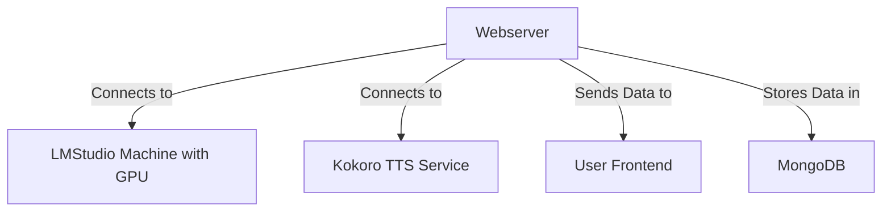

# 🧠 [BambiSleep.Chat](https://bambisleep.chat) 👁️
💖 A [r/bambisleep](https://www.reddit.com/r/BambiSleep/) targeted Hypnotic AIGF (AI Girlfriend) 🤖

<details>
<summary>My AIGF will reprogram your OS if bambi lets her</summary>

> - Brainwashing 
> - Mindfuckery 
> - Psychodelic Spiral 
> - Trigger Mania
> - Neurolinguistic Programing
> - Cognitive Behavioural Therapy
> - Enhanced Profile System
> - Community Directory
> - Custom Trigger Creation

</details>

<!-- prettier-ignore-start -->
<!-- markdownlint-disable -->
<!-- eslint-disable -->
<!-- copilot:ignore -->
```markdown
 _____ ______   _______   ___       ___  __    ________  ________   _______   ________
|\   _ \  _   \|\  ___ \ |\  \     |\  \|\  \ |\   __  \|\   ___  \|\  ___ \ |\   __  \
\ \ \ \ \_\ \  \ \   __/|\ \  \    \ \  \/  /|\ \  \|\  \ \ \ \ \  \ \   __/|\ \  \|\  \
 \ \ \ \|__| \  \ \  \_|/_\ \  \    \ \   ___  \ \   __  \ \ \ \ \  \ \  \_|/_\ \   __  \
  \ \  \    \ \  \ \  \_|\ \ \  \____\ \ \ \ \  \ \  \ \  \ \ \ \ \  \ \  \_|\ \ \  \ \  \
   \ \__\    \ \__\ \_______\ \_______\ \_\ \ \__\ \__\ \__\ \_\ \ \__\ \_______\ \__\ \__\
    \|__|     \|__|\|_______|\|_______|\|__| \|__|\|__|\|__| \|__|\|_______|\|__|\|__| |__|
```
<!-- copilot:end-ignore -->
<!-- eslint-enable -->
<!-- markdownlint-enable -->
<!-- prettier-ignore-end -->


<details>
<summary>Lawfull Good Scrapers</summary>

> The Lawful Good Bambisleep Scrapers are designed to facilitate the scraping, processing, and analysis of content related to BambiSleep. It utilizes multiple worker 
> threads to handle different content types, including text, images, and videos. The project is structured to allow for easy extension and integration of various models 
> for enhanced performance and capabilities. With the new multi-mode profile system, users can now save and organize their favorite scraped content.

</details>

```js
Running Version: MK-XI
Monetization: Patreon
Last Updated: May 2025
```

## 📖 Quick Links
- [💾 Installation](#installation)
- [⚡ Core Features](#-core-features)
- [🏗️ Architecture](#️-architecture)
- [🛠️ Tech Stack](#️-tech-stack)
- [🗂️ Folder Structure](#️-folder-structure)
- [🔒 Security Features](#-security-features)
- [📚 Documentation](#documentation)

## Installation

### Prerequisites
- Node.js >= 18.0.0
- MongoDB server
- Docker (for TTS functionality)

### MongoDB Configuration

BambiSleep Chat requires MongoDB for data persistence. The application includes several utilities to help you set up:

```bash
# Test MongoDB connection and functionality
npm run test:mongodb

# Check MongoDB server status and configuration
npm run check:mongodb

# Validate environment variables for MongoDB
npm run check:config

# Check MongoDB installation (Linux only)
npm run check:mongo-install
```

See the detailed [MongoDB Setup Guide](src/utils/MONGODB-SETUP.md) for complete instructions.

### Getting Started

1. **Install Node Version Manager**
```bash
# Windows
curl -o- https://raw.githubusercontent.com/nvm-sh/nvm/v0.40.2/install.sh | bash
# Linux
wget -qO- https://raw.githubusercontent.com/nvm-sh/nvm/v0.40.2/install.sh | bash
# Make nvm available immediately
export NVM_DIR="$([ -z "${XDG_CONFIG_HOME-}" ] && printf %s "${HOME}/.nvm" || printf %s "${XDG_CONFIG_HOME}/nvm")"
[ -s "$NVM_DIR/nvm.sh" ] && \. "$NVM_DIR/nvm.sh"
```

2. **Install Node.js**
```bash
nvm install node
```

3. **Install Dependencies**
```bash
npm install
```

4. **Configure Environment**
Create a `.env` file in the root directory:
```bash
# Server config
SERVER_PORT=6969

# LMStudio connection
LMS_HOST=192.168.0.178
LMS_PORT=7777

# Text-to-speech connection
KOKORO_PORT=8880
KOKORO_HOST=192.168.0.178
KOKORO_DEFAULT_VOICE=af_bella
KOKORO_API_KEY=not-needed

# Database connections
MONGODB_URI=mongodb://<USER>:<PASSWORD>@<IP-ADDRESS>:<PORT>/bambisleep?authSource=admin
MONGODB_PROFILES=mongodb://<USER>:<PASSWORD>@<IP-ADDRESS>:<PORT>/bambisleep-profiles?authSource=admin

# AI models
MODEL_1=llama-3.2-3b-claude-3.7-sonnet-reasoning-distilled@q4_0
MODEL_2=L3-SthenoMaidBlackroot-8B-V1@q2_k
```

5. **Start the Server**
```bash
npm run start
```

6. **Setup Text-to-Speech (Optional)**
```bash
# Using Docker for Kokoro TTS
docker run -p 8880:8880 ghcr.io/remsky/kokoro-fastapi-cpu:latest
# Or with GPU support
docker run --gpus all -p 8880:8880 ghcr.io/remsky/kokoro-fastapi-gpu:latest
```

## 🌟 Core Features

- ⚡ **Global Chat** - Real-time communication with other users
- 🗣️ **Audio Synthesis** - Hear AI responses with text-to-speech
- 💾 **Bambi Name Persistence** - Your identity stays consistent
- 🎮 **Trigger System** - Customizable hypnotic triggers
- 👑 **Free Access** - Core features available without payment
- 📝 **Custom Collar** - Personalized system messages
- 📈 **Stream Processing** - Efficient real-time AI responses
- 👥 **Community Directory** - Find and connect with other users
- 🔧 **Custom Trigger Creation** - Design your own triggers
- 🌍 **Public/Private Profiles** - Control your visibility
- 🔄 **Enhanced Scraping** - Get content from external sources
- 📌 **Bookmark System** - Save your favorite content

## 🏗️ Architecture



## Key Functionality

### 1. AI Girlfriend Experience (`text-to-text`)  
- Write your prompt & submit  
- BambiSleep will reply with hypnotic content based on your profile
- Triggers are incorporated into responses for brainwashing effects

### 2. Psychedelic Trigger Mania
- Visual effects that intensify the longer you view them
- Synchronized with audio and text for immersive experience

### 3. Trigger System
- Enable the spiral to display triggers in AI responses
- Create custom triggers through your profile
- Share triggers with the community

### 4. Text-to-Speech
- AI responses spoken aloud with natural voice
- Synchronized audio/text/visual experience
- Multiple voice options

### 5. Real-time Chat
- Global chat with other users
- Patreon username integration for supporters
- Seamless experience across pages

### 6. Profile System
- Customizable public profiles
- Personal trigger management
- Progress tracking
- Content sharing capabilities

## 🛠️ Tech Stack

- 🔧 **Backend**: Node.js, Express, Socket.IO
- ⚙️ **Processing**: Worker Threads, Child Process
- 🤖 **AI**: Llama3, Claude 3.7 Sonnet
- 🔊 **Audio**: Kokoro TTS
- 🖥️ **Frontend**: EJS, Vanilla JavaScript, Socket.io
- 🛠️ **Utilities**: Axios, UUID
- 📦 **Database**: MongoDB

## 🔒 Security Features

- 🔑 **Session-based Authentication** - Secure user sessions
- 🛡️ **Message Filtering** - Content moderation system
- 🌐 **CORS Configuration** - Controlled cross-origin access
- 🚫 **Protected Routes** - Secured endpoints
- 🔒 **Secure WebSockets** - Encrypted real-time communication
- 🔐 **Privacy Controls** - User-managed visibility settings
- 🛡️ **Data Encryption** - Protected sensitive information

## Documentation

For more detailed information about specific features:

- [📘 API Documentation](docs/API.md)
- [📕 User Guide](docs/USER-GUIDE.md)
- [📗 Installation Guide](docs/INSTALLATION.md)
- [📙 MongoDB Setup](src/utils/MONGODB-SETUP.md)

## 🗂️ Folder Structure

```
src/
├── config/             - Application configuration
├── models/             - Database schemas
├── public/             - Static assets
│   ├── audio/          - Sound effects and audio files
│   ├── css/            - Stylesheets
│   ├── gif/            - Animated images
│   ├── js/             - Client-side scripts
│   │   └── controls/   - UI control components
├── routes/             - Express routes
├── services/           - Business logic services
├── utils/              - Utility functions
├── views/              - EJS templates
│   └── partials/       - Reusable components
└── workers/            - Background process handlers
```

## Support

Need help or have questions?

- [🌐 Official Website](https://bambisleep.chat)
- [🎮 Discord Community](https://discord.gg/E7U5BxVttv)
- [💲 Patreon Support](https://www.patreon.com/c/BambiSleepChat)
- [💭 Reddit Community](https://www.reddit.com/r/BambiSleepChat/)

## License

This project is licensed under the Apache-2.0 License - see [LICENSE](LICENSE) for details.

```
© 2025 BambiSleep.Chat | Made with 💋 by melkanea
```
