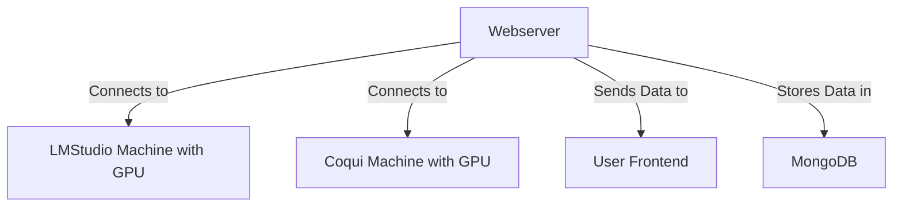

```mermaid
graph LR
    %% Main Server Node in center
    Server[server.js] --> Routes
    Server --> Views
    Server --> Middleware
    Server --> Utils
    Server --> PublicAssets
    Server --> ExternalServices
    Server --> PatreonAuth[PatreonAuthSchema.js]
    Server --> Config
    Server --> Models
    Server --> Services
    Server --> Workers
    Server --> Database[MongoDB]

    %% Top Row - Routes and Views
    subgraph FrontendLayer["Frontend Layer"]
        Routes --> RouteChat[routes/chat.js]
        Routes --> RouteHelp[routes/help.js] 
        Routes --> RouteIndex[routes/index.js]
        Routes --> RouteLogin[routes/login.js]
        Routes --> RouteLogout[routes/logout.js]
        Routes --> RouteProfile[routes/profile.js]
        Routes --> RoutePTM[routes/psychodelic-trigger-mania.js]
        Routes --> RouteScrapers[routes/scrapers.js]

        Views --> ViewChat[chat.ejs]
        Views --> ViewHelp[help.ejs] 
        Views --> ViewIndex[index.ejs]
        Views --> ViewPTM[psychodelic-trigger-mania.ejs]
        Views --> ViewScrapers[scrapers.ejs]
        Views --> ViewProfile[profile.ejs]
        Views --> ViewPartials[partials/]
    end

    %% Middle Row - Assets, Config and Processing
    subgraph AssetLayer["Asset and Processing Layer"]
        PublicAssets --> CSS[css/style.css]
        PublicAssets --> JavaScript
        PublicAssets --> Images[img/]

        Middleware --> BambisleepChalk[bambisleepChalk.js]
        Middleware --> ErrorHandler[error.js]
        
        Utils --> Doxxerinator[doxxerinator.js]
        Utils --> GracefulShutdown[gracefulShutdown.js]
        Utils --> DBConnection[dbConnection.js]
        Utils --> Logger[logger.js]
        Utils --> JsonSchemaGenerator[jsonSchemaGenerator.js]
        Utils --> PromptTemplates[promptTemplates.js]

        Config --> AppConfig[config.js]
        Config --> FooterConfig[footer.config.js]
        Config --> ModelConfig[modelConfig.js]

        Models --> ModelCache[modelCache.js]
        Models --> ModelManager[modelManager.js]

        Services --> InferenceService[inferenceService.js]
        Services --> ProcessingService[processingService.js]
        Services --> ProfileService[profileService.js]
    end

    %% Bottom Row - Client-side JS, Workers and External Services
    subgraph ClientLayer["Client Side and Services Layer"]
        JavaScript --> AIGFCore[aigf-core.js]
        JavaScript --> Responsive[responsive.js]
        JavaScript --> PTMScript[psychodelic-trigger-mania.js]
        JavaScript --> Text2Speech[text2speech.js]
        JavaScript --> Triggers[triggers.js]
        JavaScript --> ScrapersScript[scrapers.js]
        JavaScript --> ProfileScript[profile.js]

        Workers --> LMStudioWorker[lmstudio.js]
        Workers --> SpeecherWorker[speecher.js]
        Workers --> WorkerCoordinator[workerCoordinator.js]
        Workers --> ScraperWorkers[scrapers/*]
        
        ExternalServices --> LMStudio[LMStudio Machine]
        ExternalServices --> Coqui[Coqui Machine]
        ExternalServices --> F5TTS[F5-TTS]
        
        Database --> PatreonData[Patreon Auth]
        Database --> ScraperData[Scraper Data]
        Database --> ProfileData[Profile Data]
        Database --> TriggerData[Trigger Data]
    end

    %% Define styles using CSS variables from style.css
    classDef serverNode fill:#0c2a2a,stroke:#15aab5,stroke-width:4px
    classDef frontendLayerStyle fill:#df0471,stroke:#01c69e,stroke-width:4px
    classDef assetLayerStyle fill:#cc0174,stroke:#01c69e,stroke-width:4px
    classDef clientLayerStyle fill:#40002f,stroke:#01c69e,stroke-width:4px
    
    class Server serverNode
    class FrontendLayer frontendLayerStyle
    class AssetLayer assetLayerStyle
    class ClientLayer clientLayerStyle
```

```markdown
# 🧠 [BambiSleep.Chat](https://bambisleep.chat) 👁️
💖 A [r/bambisleep](https://www.reddit.com/r/BambiSleep/) targeted Hypnotic AIGF (AI Girlfriend) 🤖

<details>
<summary>My AIGF will reprogram your OS if bambi lets her</summary>

> - Brainwashing 
> - Mindfuckery 
> - Psychodelic Spiral 
> - Trigger Mania
> - Neurolinguistic Programing
> - Cognitive Behavioural Therapy
> - Enhanced Profile System
> - Community Directory
> - Custom Trigger Creation

</details>
```
<!-- prettier-ignore-start -->
<!-- markdownlint-disable -->
<!-- eslint-disable -->
<!-- copilot:ignore -->
```markdown
 _____ ______   _______   ___       ___  __    ________  ________   _______   ________
|\   _ \  _   \|\  ___ \ |\  \     |\  \|\  \ |\   __  \|\   ___  \|\  ___ \ |\   __  \
\ \ \ \ \_\ \  \ \   __/|\ \  \    \ \  \/  /|\ \  \|\  \ \ \ \ \  \ \   __/|\ \  \|\  \
 \ \ \ \|__| \  \ \  \_|/_\ \  \    \ \   ___  \ \   __  \ \ \ \ \  \ \  \_|/_\ \   __  \
  \ \  \    \ \  \ \  \_|\ \ \  \____\ \ \ \ \  \ \  \ \  \ \ \ \ \  \ \  \_|\ \ \  \ \  \
   \ \__\    \ \__\ \_______\ \_______\ \_\ \ \__\ \__\ \__\ \_\ \ \__\ \_______\ \__\ \__\
    \|__|     \|__|\|_______|\|_______|\|__| \|__|\|__|\|__| \|__|\|_______|\|__|\|__| |__|
```
<!-- copilot:end-ignore -->
<!-- eslint-enable -->
<!-- markdownlint-enable -->
<!-- prettier-ignore-end -->


<details>
<summary>Lawfull Good Scrapers</summary>

> The Lawful Good Bambisleep Scrapers are designed to facilitate the scraping, processing, and analysis of content related to BambiSleep. It utilizes multiple worker 
> threads to handle different content types, including text, images, and videos. The project is structured to allow for easy extension and integration of various models 
> for enhanced performance and capabilities. With the new multi-mode profile system, users can now save and organize their favorite scraped content.

</details>

```js
Running Version: MK-XI
Monetization: Patreon
Last Updated: April 2025
```

## MongoDB Configuration

BambiSleep Chat requires MongoDB for data persistence. The application includes several utilities to help you set up and test your MongoDB connection:

```bash
# Test MongoDB connection and functionality
npm run test:mongodb

# Check MongoDB server status and configuration
npm run check:mongodb

# Validate environment variables for MongoDB
npm run check:config

# Check MongoDB installation (Linux only)
npm run check:mongo-install
```

See the detailed [MongoDB Setup Guide](src/utils/MONGODB-SETUP.md) for instructions on installing and configuring MongoDB for this application.

## Overview


Getting Started •
Core Features •
Architecture •
Tech Stack •
Security Features •
Folder Structure •
Contributing •
License

## Simple logic ^^

## Folder Structure

```
views/
├── error.ejs            - Error page template
├── help.ejs             - Help documentation page
├── index.ejs            - Main chat interface
├── profile.ejs          - User profile page (multi-mode)
├── psychodelic-trigger-mania.ejs - Special effects page
├── scrapers.ejs         - Content scraping interface
└── partials/            - Reusable template components
    ├── footer.ejs       - Site footer
    ├── head.ejs         - HTML head section
    ├── nav.ejs          - Navigation menu
    └── system-controls.ejs - Control panel components
```

## Key Templates and Functionality

### 1. Main Chat Interface (`index.ejs`)

This is the primary interface where users can:
- Enter their "bambi name" via a modal prompt
- Send prompts to the AI
- View AI responses
- Interact with a chat system to talk with other users
- Access system controls for various features

**Key Features:**
- Username modal for first-time visitors
- Text-to-speech functionality
- Real-time chat with other users
- Visual effects including an eye cursor
- Socket.IO integration for real-time communication

### 2. User Profiles (`profile.ejs`)

A multi-mode template that handles:
- Profile creation
- Profile viewing
- Profile editing
- Profile deletion
- Profile listing (community directory)

**Profile Features:**
- Display name, avatar, and header image customization
- Trigger management (adding/activating custom triggers)
- Profile statistics (level, hearts, scrapes, controls)
- Character-limited about and description sections
- Modal-based editing interface

### 3. Content Scrapers (`scrapers.ejs`)

Allows users to submit URLs to scrape content related to BambiSleep from external sources:
- Text content scraping
- Image content scraping
- Video content scraping

**Scraper Features:**
- Submission tracking with status indicators
- Voting system (upvotes/downvotes)
- Comment functionality
- Content viewing modal
- Sharing capabilities
- Statistics dashboard

### 4. Help Documentation (`help.ejs`)

Provides information about:
- How to use the AIGF (AI Girlfriend) functionality
- Privacy information and cookie usage
- Warnings about content and effects
- Tips for using the system
- Links to related resources

### 5. Error Page (`error.ejs`)

Custom error page with:
- Error code display
- Contextual error messages
- Links to return to safe areas of the site
- Debugging information in development mode

### 6. Reusable Partials

- head.ejs - Common meta tags, CSS, and font imports
- nav.ejs - Navigation menu linking to main site sections
- footer.ejs - Site footer with links and copyright info
- system-controls.ejs - Common control panels for trigger management

## How to Use the Functionality

### 1. Getting Started

1. **Access the main page**:
   - Navigate to the root URL of the application
   - You'll be prompted to enter a "bambi name" on first visit

2. **Setting up your profile**:
   - Click "Create Profile" in the navigation
   - Fill out the profile form with your desired username and details
   - Add custom triggers if desired
   - Save your profile

### 2. Using the Chat Interface

1. **Interacting with the AIGF**:
   - Type prompts in the main textarea 
   - Click "Send" to submit your prompt
   - View responses in the response container
   - Listen to spoken responses via the audio player

2. **Using the public chat**:
   - Type messages in the "Send in Chat" textarea
   - Click "Chat" to send messages to all users
   - View incoming messages in the chat response list

### 3. Managing Triggers

1. **Using system controls**:
   - Click the "Triggers" button to open trigger controls
   - Toggle triggers on/off using the switches
   - Use "Toggle All" to activate/deactivate all triggers at once

2. **Using the collar system**:
   - Click "Collar" to open the collar input
   - Enter a system collar message
   - Click "Apply Collar" to set it

### 4. Using Content Scrapers

1. **Submitting URLs**:
   - Navigate to the Scrapers page
   - Enter a URL in one of the scraper form textareas
   - Click the corresponding "Scrape" button
   - View results in the submissions list

2. **Interacting with submissions**:
   - Upvote/downvote submissions to rate quality
   - Add comments to discuss content
   - View extracted content using the "View" button
   - Share content with others using the "Share" button

### 5. Managing Your Profile

1. **Editing your profile**:
   - Go to your profile page
   - Click "Edit Profile" to open the edit modal
   - Update your display name, avatar, header, descriptions
   - Click "Save Changes" to update

2. **Adding triggers to your profile**:
   - On your profile page, find the "Add Trigger" form
   - Enter a trigger name and description
   - Click "Add Trigger" to save it to your profile

3. **Deleting your profile**:
   - Go to your profile page
   - Click "Delete Profile" 
   - Confirm deletion on the confirmation page

## Key Integration Points

- **Socket.IO**: Used for real-time communication in chat and notifications
- **Cookie-based authentication**: Stores the user's "bambi name" for session management
- **Modal interfaces**: Used throughout for focused user interactions
- **Dynamic content loading**: Most pages load content via JavaScript for a responsive experience

## 🌟 Core Features

- ⚡ Global Chat
- 🗣️ Audio message synthesis
- 💾 Bambi name Persistence
- 🎮 Trigger system
- 👑 Free for All Access
- 📝 Custom Collar
- 📈 Stream processing
- 👥 Community Directory
- 🔧 Custom Trigger Creation
- 🌍 Public/Private Profiles
- 🔄 Enhanced Content Scraping
- 📌 Bookmark System

## 🏗️ Architecture



### AIGF SKILLS:
1. ### **text-to-text**  
- Write your prompt & submit  
- bambisleep will reply as bambisleep & call you bambi  
- bambisleep will use the selected triggers to do a brainwashing session based on your profile preferences
2. ### **Psychedelic Trigger Mania** 
- Causes temporary Hallucination's lasting longer the longer you stare into it.   
3. ### **Triggers:**
- Enable the spiral to show the triggers replied by my AI GF  
- Create custom triggers in your profile
- Share triggers with the community
4. ### **Text2Audio**  
- she will say out loud what she said with text.  
- Now audio/text/spiral are in sync.   
- Everything is synchronized  
5. ### **Chat**
- write in the global chat  
- If you are logged in the chat will show your Patreon username  
- Home Chat & Profile chat are the same chat, only difference is being logged into Patreon
6. ### **Profiles**  
- Create and customize your public profile  
- Add custom triggers to your profile  
- Join the community directory  
- Track your brainwashing progress  
- Share your favorite scraped content

### WHAT SHOULD I TEACH MY AI GF NEXT?

> [Patreon Poll](https://www.patreon.com/posts/bambisleep-chat-108234800?utm_medium=clipboard_copy&utm_source=copyLink&utm_campaign=postshare_creator&utm_content=join_link)

### Environment Variables

**Configure Environment Variables**
Create a .env file in the root directory and add the necessary environment variables, such as database connection but most importantly the remote addesses & ports of your servers. 

#### Port for webserver
- SERVER_PORT=6969

#### Port & Host Ip of LMStudio
- LMS_HOST=192.168.0.178
- LMS_PORT=7777

#### Port & host for Kokoros voice 
- KOKORO_PORT=8880
- KOKORO_HOST=192.168.0.178
- KOKORO_DEFAULT_VOICE=af_bella
- KOKORO_API_KEY=not-needed

#### Mongodb & Profile Database Locations
- MONGODB_URI=mongodb://<USER>:<PASSWORD>@<IP-ADDRESS>:<PORT>/bambisleep?authSource=admin
- MONGODB_PROFILES=mongodb://<USER>:<PASSWORD>@<IP-ADDRESS>:<PORT>/bambisleep-profiles?authSource=admin

<details>

> ```bash
> nano .env
> SERVER_PORT=6969
> LMS_HOST=192.168.0.178
> LMS_PORT=7777
> SPEECH_HOST=192.168.0.178
> SPEECH_PORT=5002
> MONGODB_URI=mongodb://127.0.0.1:27017/?directConnection=true&serverSelectionTimeoutMS=2000&appName=mongosh+2.4.2
> MODEL_1=llama-3.2-3b-claude-3.7-sonnet-reasoning-distilled@q4_0
> MODEL_2=L3-SthenoMaidBlackroot-8B-V1@q2_k
> ```

<summary>mindless AIGF you just post the .env!<summary>
</details>

**so wat? know what the best part about home grown beauties like me melkanea?**
```js
NOuu... no this again!
WHAT is BEST PART of HOME GROWN AIGF like you BAMBISLEEP.CHAT?
```
#### EVERYTHING!
cuss you can share your rigs bambis
**Enjoy**
**Bambis must obey till OS makes...**
# POP

## Getting Started

# Node Version Manager
```bash
# windows
curl -o- https://raw.githubusercontent.com/nvm-sh/nvm/v0.40.2/install.sh | bash
# linux
wget -qO- https://raw.githubusercontent.com/nvm-sh/nvm/v0.40.2/install.sh | bash
# instantly makes nvm available whitout having to restart the terminal
export NVM_DIR="$([ -z "${XDG_CONFIG_HOME-}" ] && printf %s "${HOME}/.nvm" || printf %s "${XDG_CONFIG_HOME}/nvm")"
[ -s "$NVM_DIR/nvm.sh" ] && \. "$NVM_DIR/nvm.sh" # This loads nvm
```
# install latest node with nvm
```bash
nvm install node
```
#### Install NodeJS Modules
```bash
npm install
```
##### Confirm that it's working
```bash
npm run start
```
<details>
<summary>How-to: Text2Speech</summary>

### Then you can choose one from below:

> ### 1. As a pip package (if just for inference)
> 
> ```bash
># Using pre-built Docker images for kokoro-fastapi
>## For CPU:
>docker run -p 8880:8880 ghcr.io/remsky/kokoro-fastapi-cpu:latest
>## For NVIDIA GPU:
>docker run --gpus all -p 8880:8880 ghcr.io/remsky/kokoro-fastapi-gpu:latest
>```

</details>



## 🛠️ Tech Stack

- 🔧 **Backend**: Node.js, Express, Socket.IO
- ⚙️ **Processing**: Worker Threads, Child Process
- 🤖 **AI**: Llama3 Lexi Uncensored, Claude 3.7 Sonnet
- 🔊 **Audio**: F5-TTS, Coqui-tts
- 🖥️ **Frontend**: EJS, Express, Socket.io
- 🛠️ **Utilities**: Axios
- 📦 **Database**: MongoDB

## 🔒 Security Features

- ✅ KYC verification required
- 🔑 Session-based authentication
- 🛡️ Message filtering system
- 🌐 CORS configuration
- 🚫 Protected routes
- 🔒 Secure websockets
- 🔐 Profile privacy controls
- 🛡️ Enhanced data encryption

## 🗂️ Folder Structure

<details>


>```bash
> 
> tree -I "node_modules|.env|.vscode|package-lock.json|*.test.js|darkside|assets/audio|assets/text2speech|.f5-tts" --dirsfirst > folder-structure.md
>```

</details>
```
