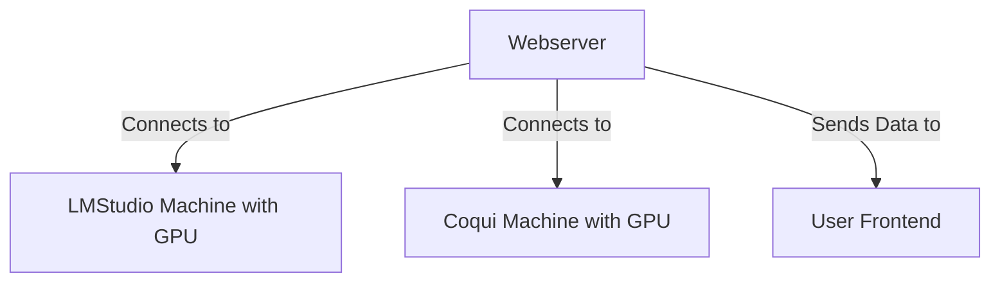
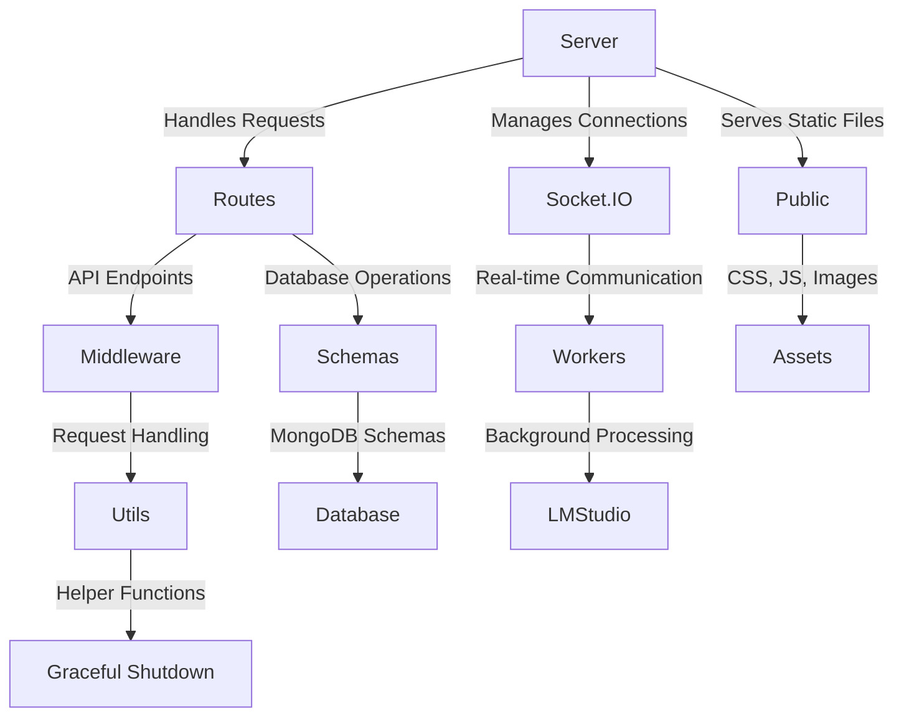
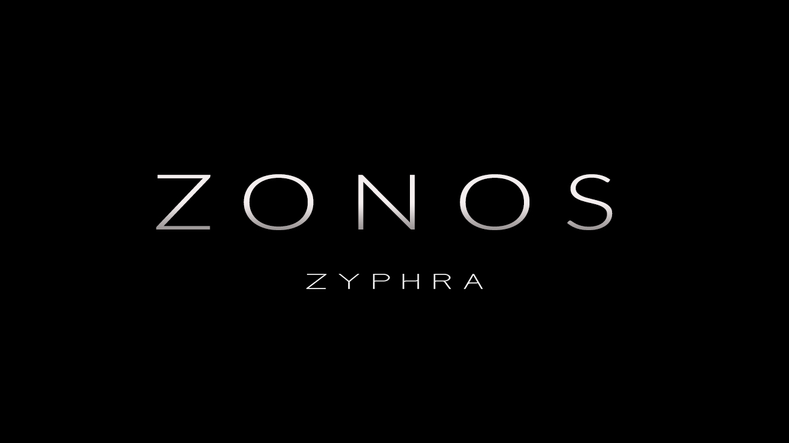
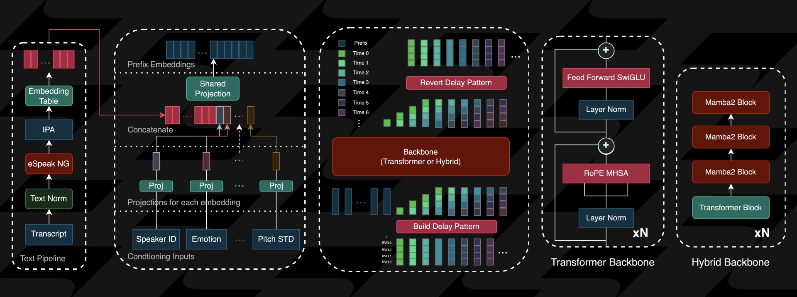

<div align="center">

```markdown
# Environment Variables

---

|\ _ \ _ \|\ **\_ \|\ \ |\ \|\_\_\ |\ ** \|\ **_ \|\ _** \ |\ ** \  
\ \ \ \ \_\ \ \ \ **/\ \ \ \ \ \/**/ \ \ \|\ \ \ \ \ \ \ \ **/|\ \ \|\ \  
 \ \ \ \|**| \ \ \ \_|/\ \ \ \ \ **\ \ \ ** \ \ \ \ \ \ \ \_|/ \ \ ** \  
 \ \ \ \ \ \ \ \_\_ \ \ \_**\ \ \_\_|\ \ \ \ \ \ \ \ \ \ \ \ \_|\ \ \ \ \ \
\ \_\_\ \ \_\_\ \_\_\_**\\ \_**\_**\ \_\ \ \_\_\ \_\_\ \_\_\ \_\ \ \_\_\ \_\_**\_\ \ \_\_\ \_\_\
\|**| \|**|\|\_\_\_\_**|\|**\_\_\_**|\|**| \|**|\|**|\|**|\|**| \|**|\|**\_\_**|\|**|\|\_**|
```


🤖 A hyper-advanced AIGF (AI Girlfriend) brainwashing experience, Psychodelic trigger Mania

[Getting Started](#-quick-start) •
[Core Features](#-core-features) •
[Architecture](#-architecture) •
[Tech Stack](#-tech-stack) •
[Security Features](#-security-features) •
[Folder Structure](#-folder-structure) •
[Contributing](#-contributing) •
[License](#-license)

</div>

## Installation



#### System dependencies

Zonos depends on the eSpeak library phonemization. You can install it on Ubuntu with the following command:

```bash
apt install -y espeak-ng # For Ubuntu
# brew install espeak-ng # For MacOS
```

#### Creating a new python venv enviroment & activating it

```bash
python3 -m venv .zonos
source .zonos/bin/activate
```

##### Installing into the system/actived environment using pip

```bash
pip install -e .
pip install --no-build-isolation -e .[compile] # optional but needed to run the hybrid
```

#### Install NodeJS Modules

```bash
npm install
```

##### Confirm that it's working

```bash
npm run start
```

## 🌟 Core Features

- ⚡ Global Chat
- 🗣️ Audio message synthesis
- 💾 Bambi name Persistence
- 🎮 Trigger system
- 👑 Free for All Access
- 📝 Custom Collar
- 📈 Stream processing

## 🏗️ Architecture



## 🛠️ Tech Stack

- 🔧 **Backend**: Node.js, Express, Socket.IO
- ⚙️ **Processing**: Worker Threads, Child Process
- 🤖 **AI**: Llama3 Lexi Uncensored,
- 🔊 **Audio**: Zonos, coqui
- 🖥️ **Frontend**: EJS, Express, Socket.io
- 🛠️ **Utilities**: Axios

## 🔒 Security Features

- ✅ KYC verification required
- 🔑 Session-based authentication
- 🛡️ Message filtering system
- 🌐 CORS configuration
- 🚫 Protected routes
- 🔒 Secure websockets

## 🗂️ Folder Structure

```
│   .env
│   .env.example
│   .gitignore
│   .python-version
│   bambi.wav
│   brandynette-isthe-bestest-bambi-xtts.wav
│   CONDITIONING_README.md
│   docker-compose.yml
│   Dockerfile
│   filteredWords.json
│   gradio_interface.py
│   LICENSE
│   package-lock.json
│   package.json
│   pyproject.toml
│   README.md
│   server.js
│   structure.md
│   uv.lock
│
├───assets
│   │   ArchitectureDiagram.png
│   │   bambi.wav
│   │   exampleaudio.mp3
│   │   silence_100ms.wav
│   │   ZonosHeader.png
│   │
│   ├───audio
│   └───js
│       └───node_modules
│           └───@socket.io
│               └───component-emitter
│                       package.json
│
├───config
│       config.js
│       footer.config.js
│
├───middleware
│       bambisleepChalk.js
│       error.js
│
├───public
│   │   apple-touch-icon.png
│   │   favicon-16x16.png
│   │   favicon-32x32.png
│   │   favicon.ico
│   │
│   ├───css
│   │       bootstrap.min.css
│   │       bootstrap.min.css.map
│   │       style.css
│   │
│   ├───img
│   │       bambisleep-chat.gif
│   │       brandynette.gif
│   │       in-her-bubble.gif
│   │
│   └───js
│           aigf-core.js
│           bootstrap.min.js
│           psychodelic-trigger-mania.js
│           responsive.js
│           text2speech.js
│           triggers.js
│
├───routes
│       help.js
│       index.js
│       psychodelic-trigger-mania.js
|
│
├───schemas
│       PatreonAuthSchema.js
│
├───utils
│       doxxerinator.js
│       gracefulShutdown.js
│       scraper.js
│
├───views
│   │   chat.ejs
│   │   help.ejs
│   │   index.ejs
│   │   psychodelic-trigger-mania.ejs
│   │   zonos.ejs
│   │
│   └───partials
│           footer.ejs
│           head.ejs
│           nav.ejs
│           system-controls.ejs
│
└───workers
    │   lmstudio.js
    │
    ├───zonos
    │   │   autoencoder.py
    │   │   codebook_pattern.py
    │   │   conditioning.py
    │   │   config.py
    │   │   model.py
    │   │   sampling.py
    │   │   speaker_cloning.py
    │   │   utils.py
    │   │
    │   ├───backbone
    │   │   │   _mamba_ssm.py
    │   │   │   _torch.py
    │   │   │   __init__.py
    │   │   │
    │   │   └───__pycache__
    │   │           _mamba_ssm.cpython-312.pyc
    │   │           _torch.cpython-312.pyc
    │   │           __init__.cpython-312.pyc
    │   │
    │   └───__pycache__
    │           autoencoder.cpython-312.pyc
    │           codebook_pattern.cpython-312.pyc
    │           conditioning.cpython-312.pyc
    │           config.cpython-312.pyc
    │           model.cpython-312.pyc
    │           sampling.cpython-312.pyc
    │           speaker_cloning.cpython-312.pyc
    │           utils.cpython-312.pyc
    │
    └───zonos.egg-info
            dependency_links.txt
            PKG-INFO
            requires.txt
            SOURCES.txt
            top_level.txt

```

# Zonos-v0.1

<div align="center">

</div>

<div align="center">
  <a href="https://discord.gg/gTW9JwST8q" target="_blank">
    
  </a>
</div>
---

Zonos-v0.1 is a leading open-weight text-to-speech model trained on more than 200k hours of varied multilingual speech, delivering expressiveness and quality on par with—or even surpassing—top TTS providers.

Our model enables highly natural speech generation from text prompts when given a speaker embedding or audio prefix, and can accurately perform speech cloning when given a reference clip spanning just a few seconds. The conditioning setup also allows for fine control over speaking rate, pitch variation, audio quality, and emotions such as happiness, fear, sadness, and anger. The model outputs speech natively at 44kHz.

##### For more details and speech samples, check out our blog [here](https://www.zyphra.com/post/beta-release-of-zonos-v0-1)

##### We also have a hosted version available at [playground.zyphra.com/audio](https://playground.zyphra.com/audio)

---

Zonos follows a straightforward architecture: text normalization and phonemization via eSpeak, followed by DAC token prediction through a transformer or hybrid backbone. An overview of the architecture can be seen below.

<div align="center">

</div>

---

## Usage

### Python

```python
import sys
import torch
import torchaudio
from zonos.model import Zonos
from zonos.conditioning import make_cond_dict
from zonos.utils import DEFAULT_DEVICE as device

# model = Zonos.from_pretrained("Zyphra/Zonos-v0.1-hybrid", device=device)
model = Zonos.from_pretrained("Zyphra/Zonos-v0.1-transformer", device=device)

text = sys.argv[1] if len(sys.argv) > 1 else "Hello, world!"
filename = sys.argv[2] if len(sys.argv) > 2 else "bambi.wav"

wav, sampling_rate = torchaudio.load("assets/bambi.wav")
speaker = model.make_speaker_embedding(wav, sampling_rate)

torch.manual_seed(421)

cond_dict = make_cond_dict(text=text, speaker=speaker, language="en-us")
conditioning = model.prepare_conditioning(cond_dict)

codes = model.generate(conditioning)

wavs = model.autoencoder.decode(codes).cpu()
torchaudio.save(f"assets/audio/{filename}", wavs[0], model.autoencoder.sampling_rate)
```

## Overview

The Lawful Good Bambisleep Scrapers are designed to facilitate the scraping, processing, and analysis of content related to BambiSleep. It utilizes multiple worker threads to handle different content types, including text, images, and videos. The project is structured to allow for easy extension and integration of various models for enhanced performance and capabilities.

**Configure Environment Variables**
Create a `.env` file in the root directory and add the necessary environment variables, such as database connection strings and API keys.

```env
LMS_HOST=localhost
LMS_PORT=3000
MONGODB_URI=mongodb://localhost:27017/bambisleep
MODEL_1=llama-3.2-3b-claude-3.7-sonnet-reasoning-distilled@q4_0
MODEL_2=L3-SthenoMaidBlackroot-8B-V1@q2_k
CACHE_ENABLED=true
CACHE_EXPIRY=3600
API_KEY=your_api_key_here
SECRET_KEY=your_secret_key_here
```
