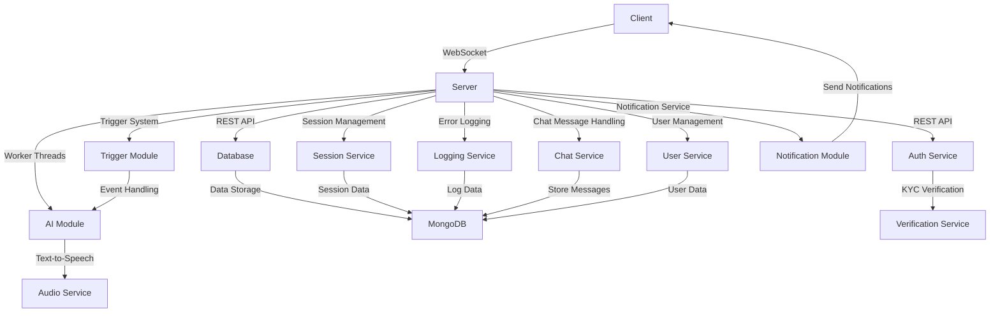

<div align="center">

# 🧠 BambiSleep Chat 👁️ 
by:
```
 ____ ______   _______   ___      ___  __    _______   ________   _______   ________     
|\   _ \  _   \|\  ___ \|\  \    |\  \|\__\ |\   __  \|\   ___  \|\  ___ \ |\   __  \    
\ \ \ \ \_\ \  \ \   __/\ \  \   \ \  \/__/ \ \  \|\  \ \ \ \ \  \ \   __/|\ \  \|\  \   
 \ \ \ \|__| \  \ \  \_|/\ \  \   \ \   __\  \ \   __  \ \ \ \ \  \ \  \_|/ \ \   __  \  
  \ \  \    \ \  \ \  \__ \ \  \___\ \ \__|\  \ \  \ \  \ \ \ \ \  \ \  \_|\ \ \  \ \  \ 
   \ \__\    \ \__\ \_____\\ \______\ \_\ \ \__\ \__\ \__\ \_\ \ \__\ \_____\ \ \__\ \__\ 
    \|__|     \|__|\|______|\|_______|\|__| \|__|\|__|\|__|\|__| \|__|\|______|\|__|\|___|
```


🤖 A hyper-advanced AIGF (AI Girlfriend) brainwashing experience powered by worker threads and websockets

[Getting Started](#-quick-start) •
[Core Features](#-core-features) •
[Architecture](#-architecture) •
[Tech Stack](#-tech-stack) •
[Security Features](#-security-features) •
[Folder Structure](#-folder-structure) •
[Contributing](#-contributing) •
[License](#-license)

</div>

## ⚡ Quick Start

1. **Clone the repository**
   ```sh
   git clone https://github.com/HarleyVader/js-bambisleep-chat.git
   ```
2. **Navigate to the project directory**
   ```sh
   cd js-bambisleep-chat
   ```
3. **Install dependencies**
   ```sh
   npm install
   ```
4. **Start the server**
   ```sh
   npm start
   ```

## 🌟 Core Features

- ⚡ Real-time bidirectional chat
- 🗣️ Audio message synthesis
- 💾 Session persistence
- 🎮 Trigger system
- 👑 Role-based access
- 📝 Error logging
- 📈 Stream processing

## 🏗️ Architecture



## 🛠️ Tech Stack

- 🔧 **Backend**: Node.js, Express, Socket.IO
- 💾 **Database**: MongoDB
- 🔐 **Auth**: Passport.js, KYC verification
- ⚙️ **Processing**: Worker Threads
- 🤖 **AI**: Local LLM API
- 🔊 **Audio**: Text-to-Speech API

## 🔒 Security Features

- ✅ KYC verification required
- 🔑 Session-based authentication
- 🛡️ Message filtering system
- 🌐 CORS configuration
- 🚫 Protected routes
- 🔒 Secure websockets

## 🗂️ Folder Structure

```                                                                                                                                                                                                                                                          
├── config
│   ├── config.js
│   └── footer.config.js
├── filteredWords.json
├── middleware
│   ├── apiClient.js
│   ├── bambisleepChalk.js
│   ├── dbFunctions.js
│   ├── error.js
│   └── oauthHandler.js
├── package.json
├── public
│   ├── apple-touch-icon.png
│   ├── css
│   │   ├── bootstrap.min.css
│   │   ├── bootstrap.min.css.map
│   │   └── style.css
│   ├── favicon-16x16.png
│   ├── favicon-32x32.png
│   ├── favicon.ico
│   ├── img
│   │   ├── bambisleep-chat.gif
│   │   ├── brandynette.gif
│   │   └── in-her-bubble.gif
│   └── js
│       ├── aigf-core.js
│       ├── bootstrap.min.js
│       ├── psychodelic-trigger-mania.js
│       ├── responsive.js
│       ├── text2speech.js
│       └── triggers.js
├── README.md
├── routes
│   ├── chat.js
│   ├── help.js
│   ├── index.js
│   ├── login.js
│   ├── logout.js
│   ├── profile.js
│   └── psychodelic-trigger-mania.js
├── schemas
│   └── PatreonAuthSchema.js
├── server.js
├── structure.md
├── UNLINCENCE.md
├── utils
│   ├── doxxerinator.js
│   ├── gracefulShutdown.js
│   └── scraper.js
├── views
│   ├── chat.ejs
│   ├── help.ejs
│   ├── index.ejs
│   ├── login.ejs
│   ├── partials
│   │   ├── footer.ejs
│   │   ├── head.ejs
│   │   ├── nav.ejs
│   │   └── system-controls.ejs
│   ├── profile.ejs
│   └── psychodelic-trigger-mania.ejs
└── workers
    ├── lmstudio.js
    ├── role2.json
    ├── role3.json
    └── role.json
```